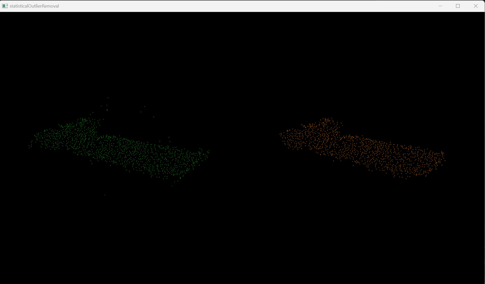

### 本周工作：

#### （1）整理总结前面几周工作

#### （2）对点云进行滤波处理

### 实验结果：

#### 1.直通滤波

原理：

​	对指定的某一维度进行滤波，去掉用户指定字段范围内（或外）的点。

#### 2.统计滤波

原理：

​	对每一点的邻域进行统计分析，基于点到所有邻近点的距离分布特征，过滤掉一些不满足要求的离群点。

#### 3.体素滤波

原理：

​	对点云数据创建一个三维体素栅格（微小的空间三维立方体的集合），用每个体素重心近似代替体素中的其他点。

#### 4.半径滤波

原理：

​	对整个输入迭代一次，对于每个点进行半径R邻域搜索，如果邻域点的个数低于某一阈值，则该点将被视为噪声点并被移除。

#### 5.投影滤波

原理：

​	将点投影到一个参数化模型上，这个参数化模型可以是平面、圆球、圆柱、锥形等进行投影滤波。

### 下周计划：

（1）对滤波后的点云提取参数结果

（2）整理实验结果与总体思路，准备开题材料

