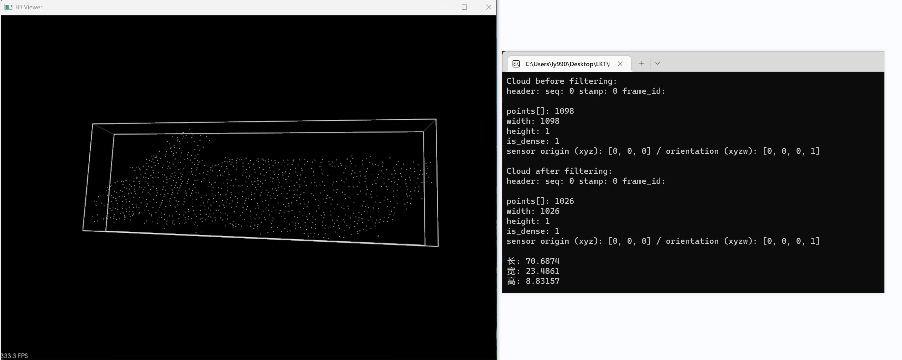
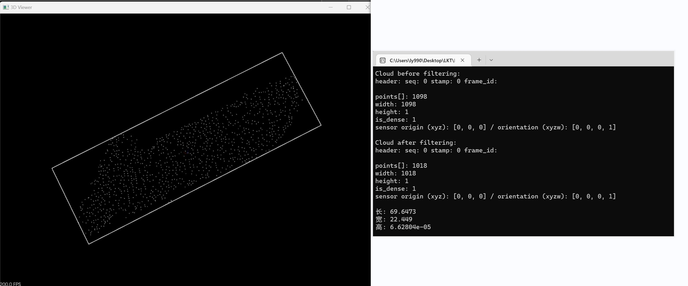
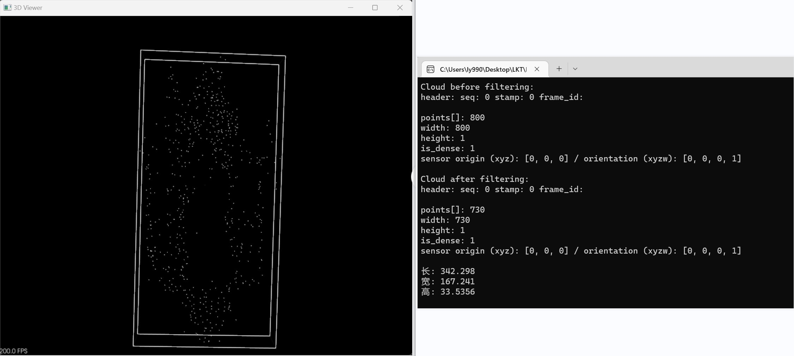
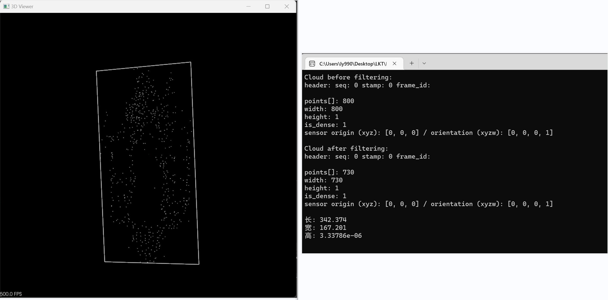

### 本周工作：

#### （1）三维点云目标尺寸信息提取

#### （2）写开题报告

------

#### OBB包围盒原理

（1）利用PCA获得点云的三个主方向，获取质心，计算协方差，获得协方差矩阵，求取协方差矩阵的特征值和特长向量，特征向量即为主方向

（2）利用主方向和质心，将输入点云转换至原点，且主方向与坐标系方向重合，建立变换到原点的点云的包围盒

（3）给输入点云设置主方向和包围盒，通过输入点云到原点点云变换的逆变换实现

------

### 实验结果：

1.帆板（上面为原始点云最小包围盒，下面为投影点云最小外接矩形）

2.飞机（上面为原始点云最小包围盒，下面为投影点云最小外接矩形）

