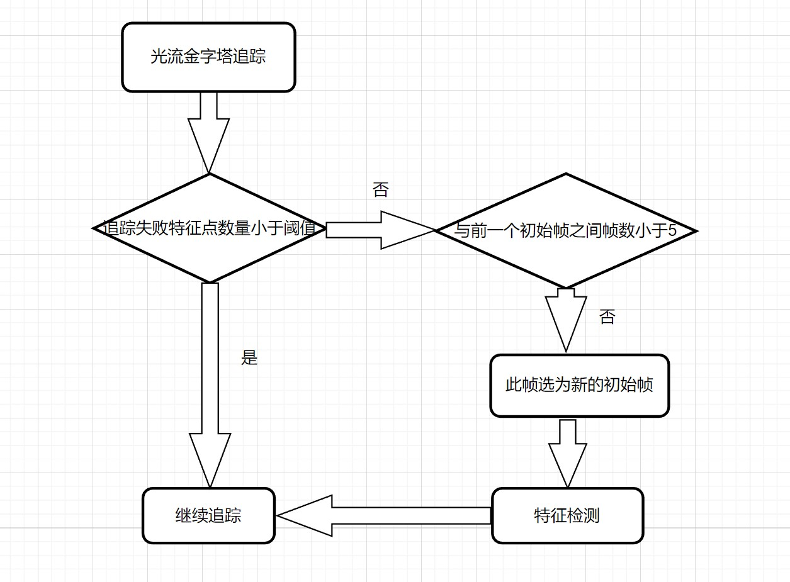
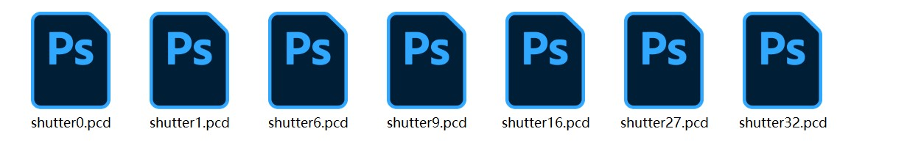
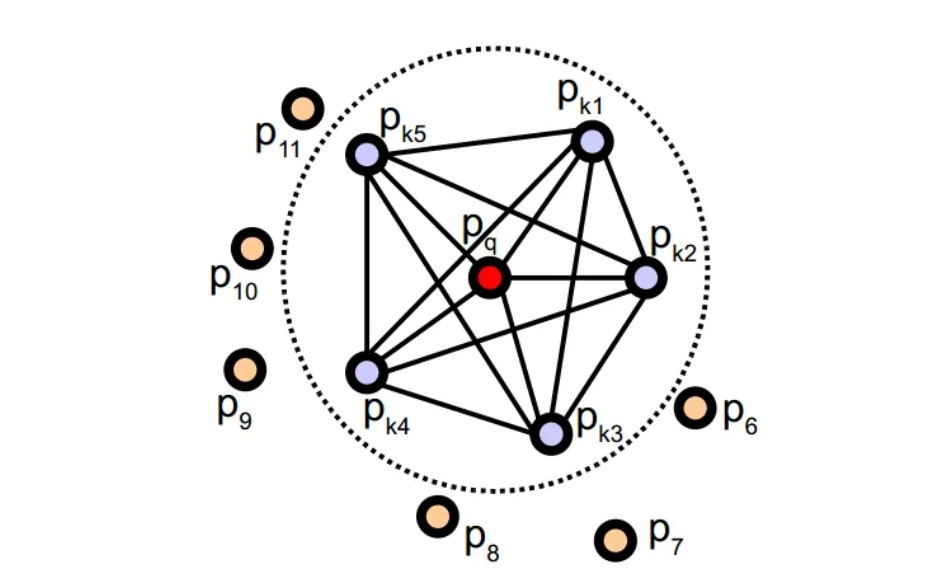
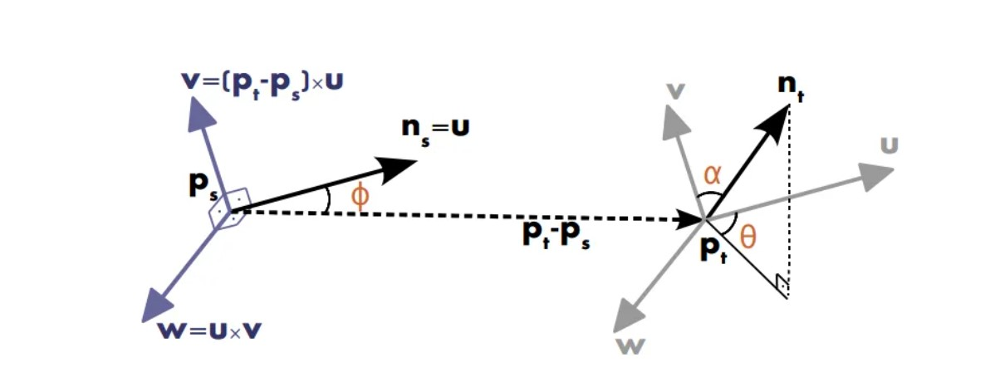
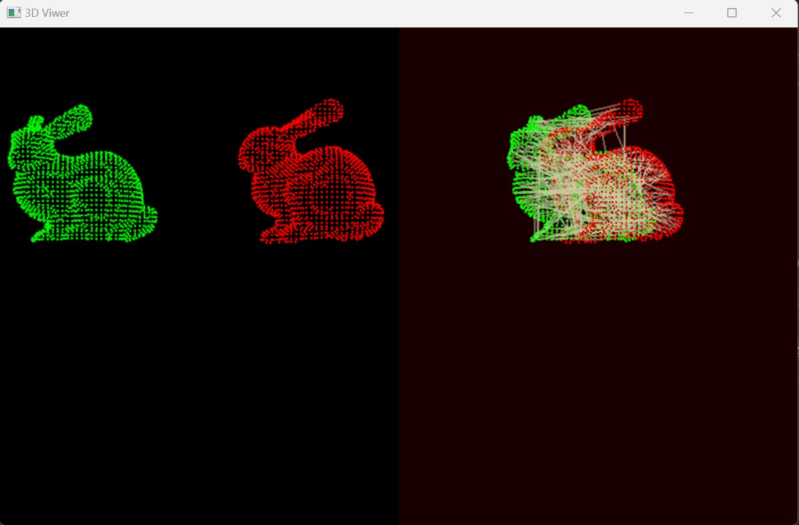

### 本周工作：

#### （1）设置初始帧选取策略，获取多副点云数据

#### （2）使用FPFH（Fast Point Feature Histograms）进行点云特征提取和匹配

------

### 一.初始帧选取策略

1.1 阈值法

​			在光流金字塔算法追踪时，当追踪失败的点数超过所设置的阈值时，将当前帧记为下一个初始帧，接着进行特征追踪，同时前一个继续保持特征追踪

1. 2 实验结果

​                        左：第1帧作为初始帧                                          右：第6帧作为初始帧

### 二.FPFH特征提取和匹配

2.1 PFH（Point Feature Histograms）基本原理

2.2 实验结果

