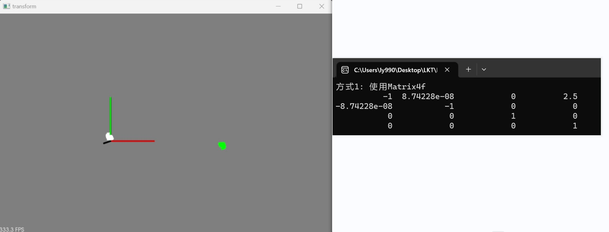
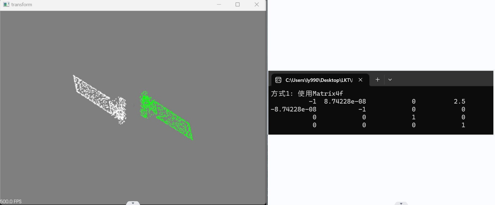
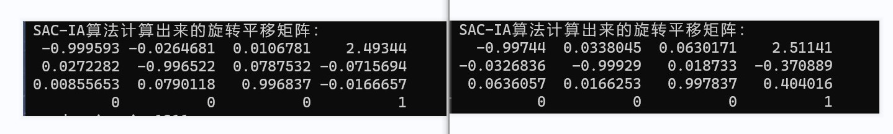
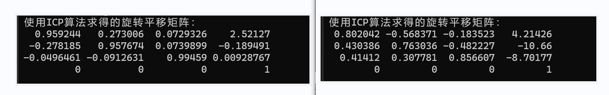
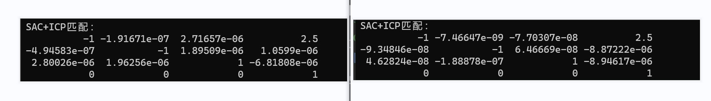

### 本周工作：

（1）分别用SAC-IA和ICP算法，求取两幅点云间变换矩阵

（2）先使用SAC-IA算法进行粗匹配，然后ICP算法进行细匹配，优化两幅点云间的变换矩阵

------

一.设定的变换矩阵

两幅点云均设定为绕X轴旋转180°，沿X轴平移2.5

二.SAC-IA算法求得两幅点云的变换矩阵

​         左：兔子点云求得的变换矩阵；右：帆板点云求得的变换矩阵（下同）

三.ICP算法求得两幅点云的变换矩阵

四.SAC-IA+ICP算法求得两幅点云的变换矩阵

