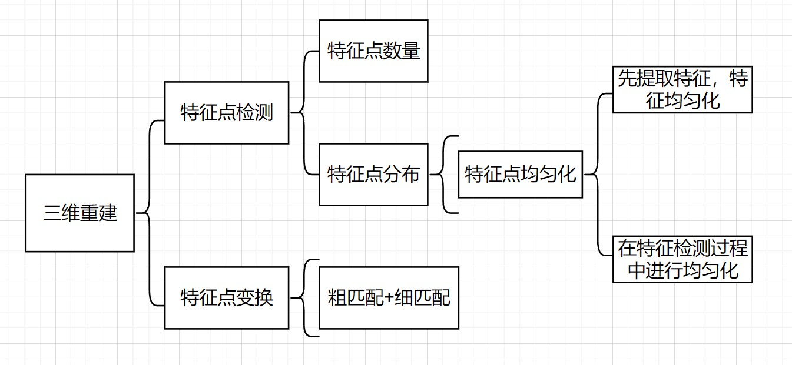

科研计划：

一.基于ISAR图像序列的三维重建

1.1 优化特征提取方法

（1）难点：ISAR图像中目标斑点存在亮度分布不均衡问题

​         解决方法：特征点体素化

​		 目的：解决ISAR图像中特征检测算法提取出来的特征点分布不均匀的情况	

1.2 优化近帧特征点变换关系

（1）难点：使用特征点匹配来计算变换矩阵，存在两个问题

​         	问题1：匹配特征点对少，导致求出的变换矩阵不准确

​         	问题2：在特征点匹配中，可能存在着大量的误匹配，影响求解结果

​          解决方法：

​			  方法一：设置匹配阈值，在匹配的特征点对低于阈值时，采用ASIFT算法重新对当前两帧图像进行特征点检测和匹配

​              方法二：可以借鉴三维点云中的粗细匹配策略，先通过初始特征点匹配求出一个初始的变换矩阵，接着借鉴三维点云中的 ICP（迭代最近邻）算法，对求得的变换矩阵进行进一步的优化

二.特征点均匀化结果

2.1 先提取特征点，然后对特征点进行均匀化

下周计划：

   (1) 学习Opencv 中关于ORB特征检测和ORB-SLAM中关于ORB特征点均匀化的内容

（2）将ORB-SLAM2中的特征点均匀化的内容添加到自己的特征点检测中
