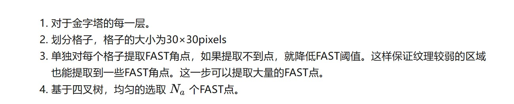
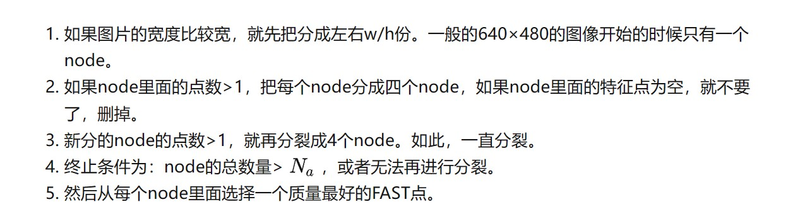
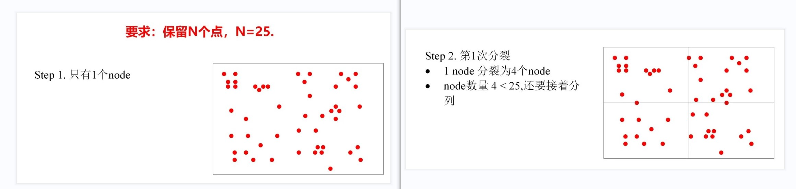
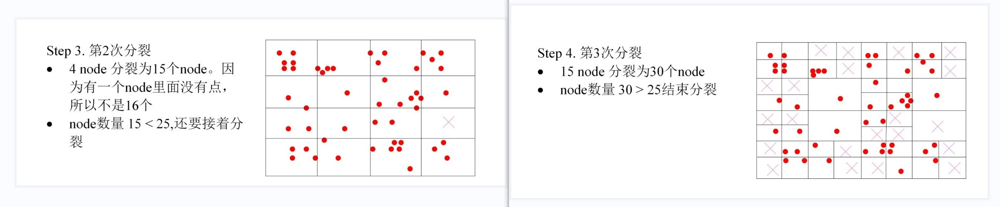
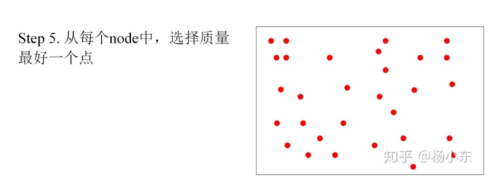
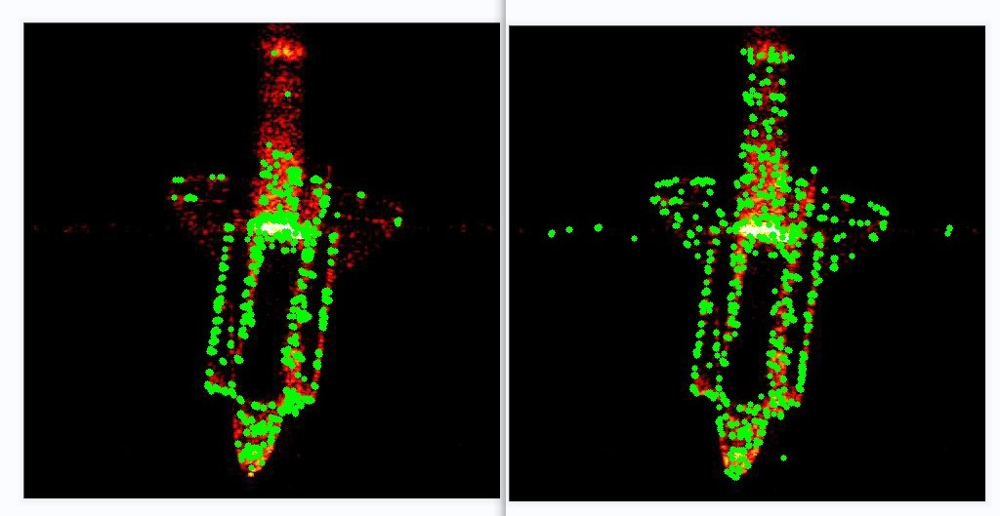
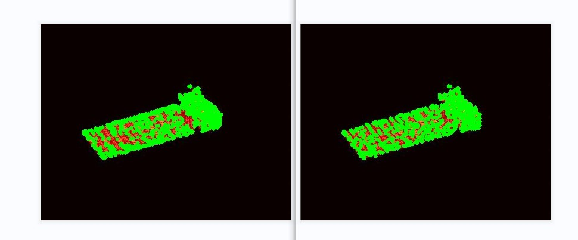
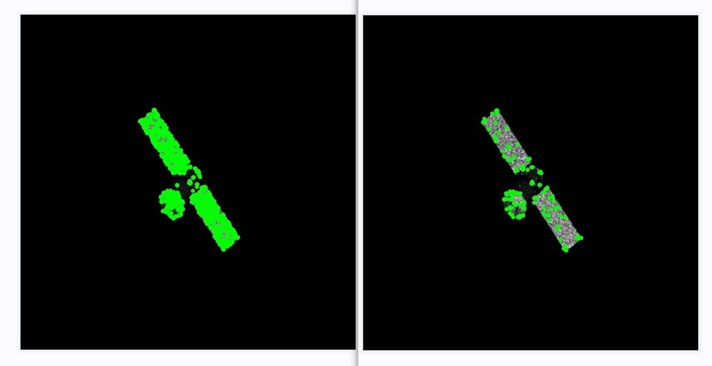

## 本周任务：

​	（1）ORB特征点均匀化

------

### 一.原理

#### 1.1 ORB（Oriented FAST and Rotated BRIEF）算法

#### 步骤：

（1）构造金字塔

（2）提取FAST角点

（3）利用灰度质心法，计算旋转角度 

（4）计算旋转后的BRIEF描述子

#### 1.2 ORB 特征均匀化

#### 

#### 四叉树方法：

#### 步骤：

#### 图例：

### 二.实验结果

​              左：原始ORB特征点检测结果；右：ORB均匀化检测结果

#### 下周计划：

（1）使用ICP算法对特征匹配进行优化
