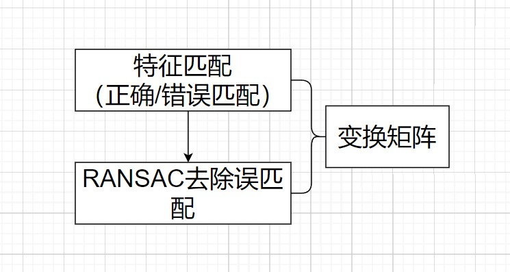
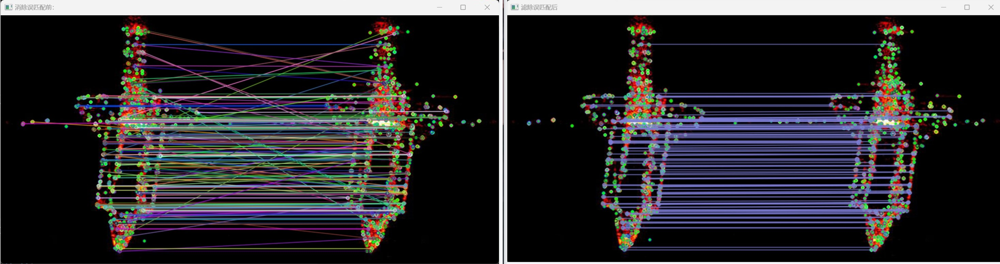
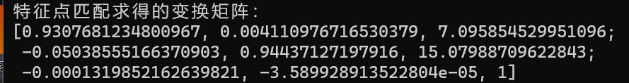
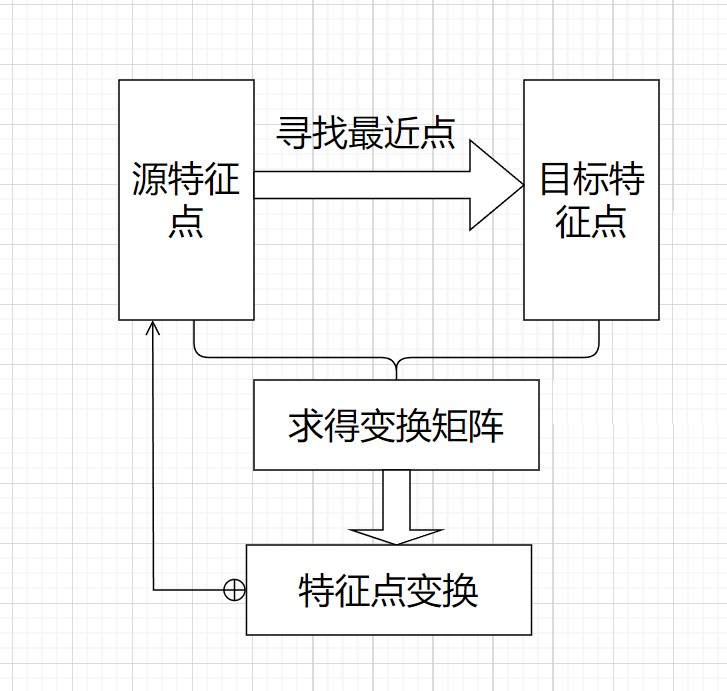
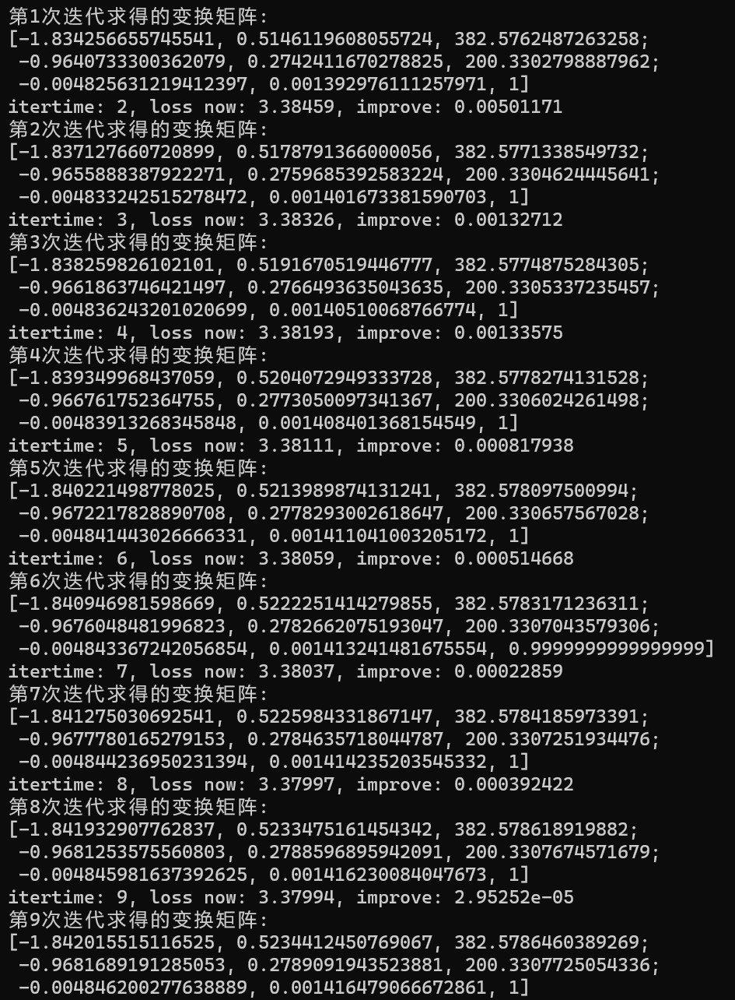
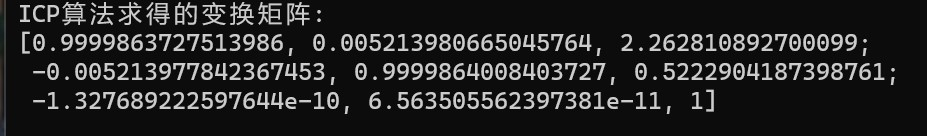

### 本周工作：

​	（1）将三维点云中的ICP算法用到二维特征点匹配

------

### 一.实验

#### 1.1 特征匹配 + RANSAC 方法求得变换矩阵

#### 1.1.1 特征匹配结果：

​                            左：所有匹配点对；  右：去除误匹配后的匹配点对

#### 1.1.2 求得的变换矩阵：

### 1.2 ICP算法求得的变换矩阵

#### 1.2.1 原理：

#### 1.2.2 迭代过程中求得的变换矩阵：

#### 1.2.3 最终求得的变换矩阵：

