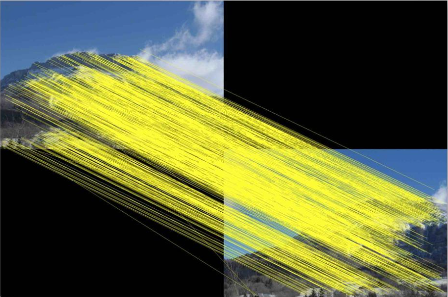
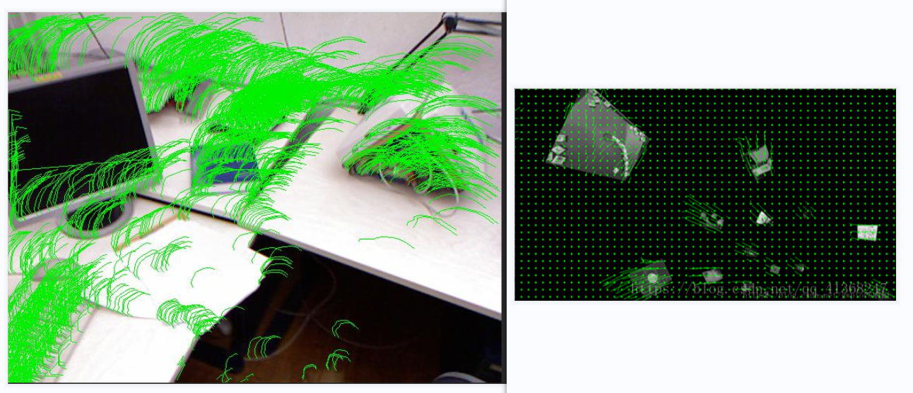
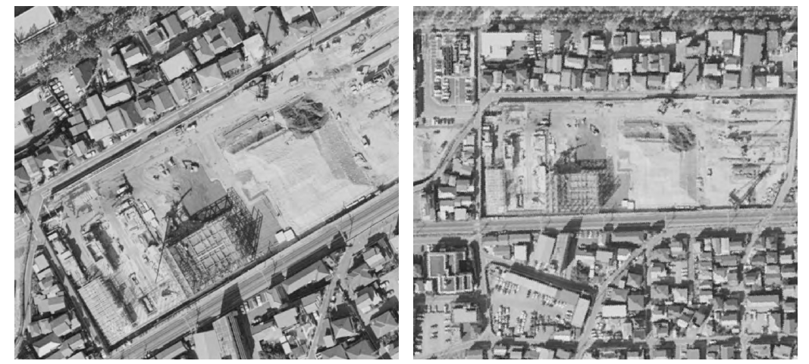
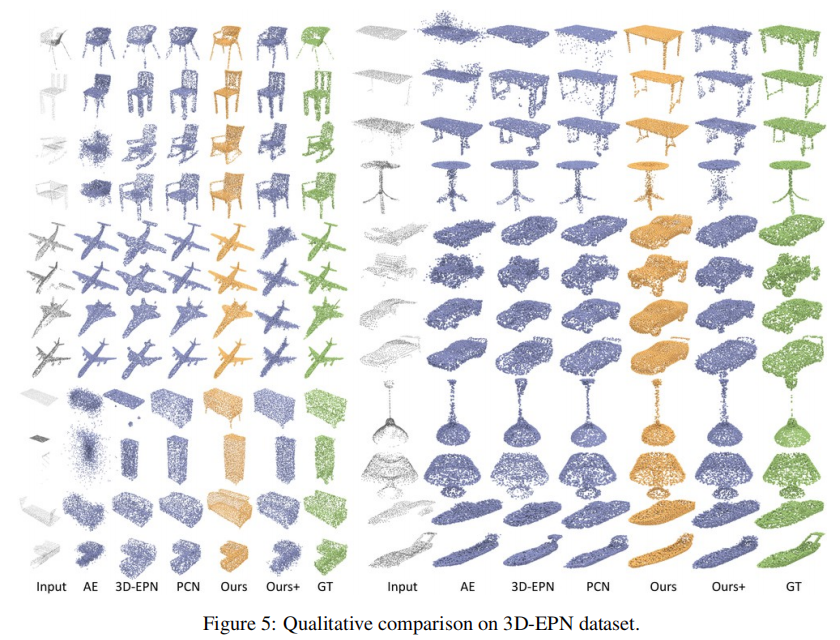
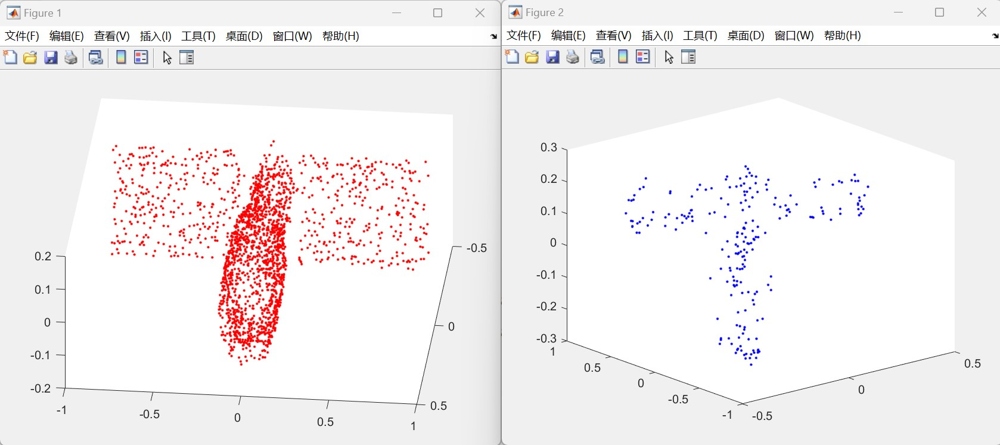
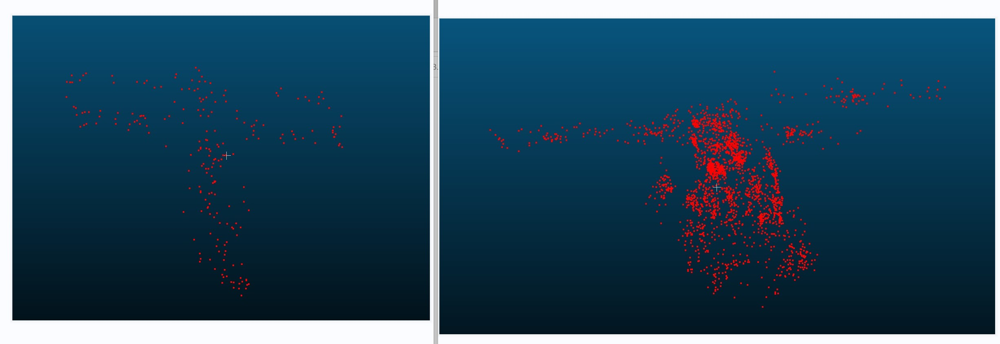

## 1.论文：基于点特征的多模与多视角图像非刚性配准算法研究

### 第五章：基于稀疏和稠密点特征联合的多视角图像非刚性配准研究

#### 多视角图像非刚性配准目前存在问题：

1）稀疏点特征匹配对应着图像的非刚性几何变换

2）稠密点特征点配准对应着图像的流场变换

**流场**：充满运动流体的空间，由无数连续的空间点组成

#### 本文采用方法：

1）稀疏点特征配准：SIFT特征提取+确定性退火算法（求解非刚性变换）

2）稠密点特征变换：SIFT流算法

#### 主要适用场景：

在遥感和航拍等图像配准场景中，待配准的图像间除了存在整体的几何形变，还存在着因视角变化、地貌改变、物体位移等形成的局域性的形变差异。

## 2.实验问题

1）数据集

问题：未找到相关空间目标三维点云（完整/缺失）的数据集

2）处理方法

将我们已有的完整空间目标点云和缺失点云添加到plane类中，作为一种特殊的plane，进行训练和补全

